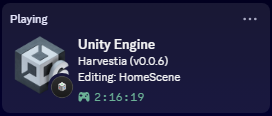
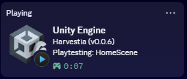

# Unity Editor Discord Rich Presence

A lightweight, high-performance, and zero-dependency Discord Rich Presence (RPC) plugin for the Unity Editor.

Connects directly to Discord via local Inter-Process Communication (IPC Named Pipe on Windows, Unix domain sockets on macOS/Linux) without requiring external native DLLs, packages, or the deprecated Discord Game SDK.

---

## Features

- **Zero External Dependencies**: Pure C# implementation using standard library IPC (`\\.\pipe\discord-ipc-0` / Unix sockets). No native libraries, wrapper binaries, or external packages.
- **Dynamic Version Matching**: Automatically selects the correct engine icon badge corresponding to your active Unity version (`Unity 6`, `2023`, `2022`, `2021`, `2020`, `2019`, `5.x`).
- **Rich Editor Context**:
  - Active Project name and project version (`bundleVersion`).
  - Active Scene name with unsaved modification indicator (`●`).
  - Prefab Isolation Mode detection (displays `Editing Prefab: <Name>`).
  - Play Mode and Pause states with dedicated visual badges.
  - Real-time compilation status (`Compiling scripts...`) and player build progress.
  - Active platform / build target and render pipeline (URP, HDRP, Built-in).
  - Session elapsed time or per-playtest timer.
  - Up to two customizable action buttons (e.g. Repository link, Website).
- **Non-Blocking & Asynchronous**: Heartbeats and socket operations run asynchronously on background threads to ensure zero editor frame hitching.
- **Included 512×512 Art Assets**: Pre-rendered, transparent 512×512 PNG assets formatted specifically for the Discord Developer Portal.
- **Built-in Preferences GUI**: Configurable via `Edit > Preferences > Discord Rich Presence` with live connection monitoring.

---

## Rich Presence Preview

| Edit Mode (Scene Editing) | Play Mode (Live Playtesting) |
| :---: | :---: |
|  |  |

| Field | Source / Format | Example |
| :--- | :--- | :--- |
| **Details** | Project Name + Version | `MyGame (v1.0.0)` |
| **State (Editing)** | Current Scene + Dirty Indicator | `Editing: MainScene ●` |
| **State (Prefab)** | Prefab Isolation Stage | `Editing Prefab: PlayerCharacter` |
| **State (Play Mode)** | Playtesting / Paused + Scene | `Playtesting: MainScene` or `Paused: MainScene` |
| **State (Compiling)** | Script Domain Compilation | `Compiling scripts...` |
| **State (Building)** | Active Player Build | `Building Windows (64-bit) Player...` |
| **Large Image & Tooltip** | Unity Version Logo + Build Target + RP | `Unity 6000.0.32f1 \| Windows (64-bit) (URP)` |
| **Small Image & Tooltip** | Context Icon (`edit`, `play`, `pause`, `compile`) | `Edit Mode`, `Play Mode`, `Paused`, `Compiling...` |
| **Elapsed Time** | Total Session Duration (or reset per Play Mode) | `01:24:50 elapsed` |
| **Buttons (Optional)** | Up to 2 customizable action buttons | `[GitHub Repo]` `[Play Demo]` |

---

## Quick Start & Installation

This plugin is **100% plug-and-play** out of the box with zero setup required:

1. Copy `UnityDiscordRichPresence.cs` into your Unity project anywhere inside an `Editor` folder (e.g. `Assets/Editor/DiscordRPC/UnityDiscordRichPresence.cs`).
2. That's it! The script automatically compiles, connects to your running Discord desktop client, and displays your presence with official engine badges.

---

## Configuration & Preferences (Optional)

The plugin works immediately with zero configuration. To customize what gets displayed, open `Edit > Preferences > Discord Rich Presence`:

- **Enable Rich Presence**: Master toggle to enable or disable presence.
- **Discord Application ID**: Your registered Discord Developer Application ID.
- **Display Options**:
  - Show / Hide Project Name and Version (`bundleVersion`)
  - Show / Hide Active Scene Name
  - Show / Hide Unsaved Changes Indicator (`●`)
  - Show / Hide Prefab Stage Name
  - Show / Hide Build Target Platform
  - Show / Hide Unity Engine Version
  - Show / Hide Active Render Pipeline (URP / HDRP / Built-in)
  - Show / Hide Elapsed Working Time
  - Reset Timer In Play Mode (track playtesting duration separately)
- **Asset Keys**:
  - **Auto Version Large Icon**: Automatically maps `Application.unityVersion` to `unity_6`, `unity_2023`, `unity_2022`, `unity_2021`, `unity_2020`, `unity_2019`, or `unity_5`.
  - **Large Image Key**: Fallback or custom override key/URL.
  - **Play / Pause / Edit / Compile Icon Keys**: Customizable small image keys.
- **Custom Buttons (Optional)**:
  - Add up to 2 clickable profile buttons with custom labels and URLs.
- **Utility Actions**:
  - **Reconnect Now**: Re-establishes named pipe IPC connection immediately.
  - **Reset Defaults**: Restores all settings to default values.

---

## Menu Shortcuts

- `Tools > Discord Rich Presence > Toggle Rich Presence` — Quick toggle without opening preferences.
- `Tools > Discord Rich Presence > Reconnect` — Force reconnect pipe handshake.
- `Tools > Discord Rich Presence > Preferences...` — Directly open the preferences page.

## Compatibility

- **Unity Versions**: Unity 5.x, 2017.x, 2018.x, 2019.x, 2020.x, 2021.x, 2022.x, 2023.x, and Unity 6 (6000.x).
- **Operating Systems**:
  - Windows (`\\.\pipe\discord-ipc-0` through `9`)
  - macOS (`/var/folders/.../discord-ipc-0` or `$TMPDIR/discord-ipc-0`)
  - Linux (`$XDG_RUNTIME_DIR/discord-ipc-0` or `/tmp/discord-ipc-0`)
- **Render Pipelines**: Built-in, Universal RP (URP), High Definition RP (HDRP).

---

## License

MIT License. Free to use, modify, and distribute in personal or commercial Unity projects.
